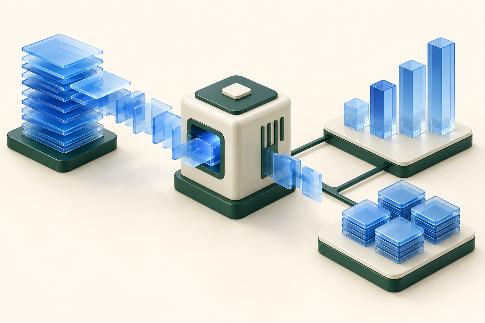

# KNUT 2026년 2학기

빅데이터, 인간컴퓨터상호작용(HCI), 네트워크 프로그래밍의 개념과 예제를 정리한 개인 학습 저장소입니다. 장별 학습 페이지를 웹에서 읽을 수 있습니다.

**[학습 사이트 열기 →](https://bass131.github.io/KNUT_2ND/)**

| 빅데이터 | 인간컴퓨터상호작용(HCI) | 네트워크 프로그래밍 |
| :---: | :---: | :---: |
|  |  |  |
| 1~3장 개념 정리 | 1~3장 전체 강의·강조 요약 | 1~2장 개념 정리·C 예제 |

공개 파일은 학습 페이지와 필요한 이미지·스타일·스크립트, 네트워크 C 예제로 구성됩니다. 강의 원본 PDF·PPTX, 추출 슬라이드 이미지, 작업 문서·검증 기록·테스트 코드·ZIP은 포함하지 않습니다.
